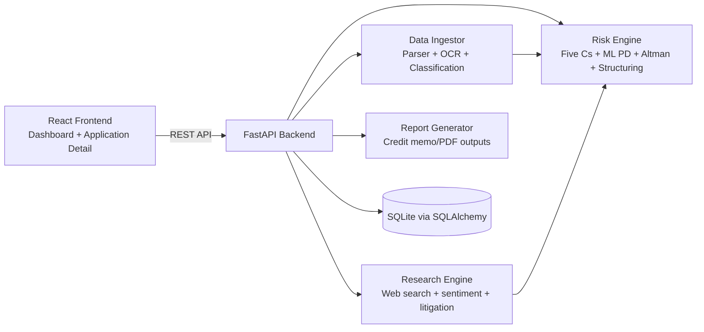

# Intelli-Credit

AI-powered corporate credit decisioning platform built for Indian lending workflows.

## What this project does

Intelli-Credit ingests borrower documents, runs secondary research, computes explainable risk scores, structures a recommended loan, and generates analyst-ready outputs for decisioning.

Core workflow:
1. Upload borrower documents (PDF/Excel/CSV/images).
2. Parse + classify + extract structured signals.
3. Enrich with web research and qualitative analyst insights.
4. Run hybrid scoring (Five Cs + PD model + Altman Z'' + loan structuring).
5. Return recommendation, key risks, covenants, and generated report artifacts.

---

## Architecture

### High-level system diagram



### Backend module map

- `backend/main.py` - API orchestration, upload pipeline, progress tracking, scoring and report endpoints.
- `backend/ingestor/parser.py` - multi-format parsing, adaptive OCR, visual OCR extraction, document-specific parsers.
- `backend/research/` - external/company research enrichment.
- `backend/engine/risk_scorer.py` - final hybrid scoring and recommendation aggregation.
- `backend/engine/ml/predictor.py` - PD prediction (ML model or calibrated rule fallback).
- `backend/engine/ml/altman_z.py` - Altman Z'' distress analysis.
- `backend/engine/loan_structurer.py` - amount/rate/tenure/covenants recommendation.
- `backend/reporting/` - report generation.

---

## Tech stack

| Layer | Stack |
|---|---|
| Frontend | React, React Router, Axios |
| Backend API | FastAPI, Pydantic |
| Persistence | SQLAlchemy, SQLite |
| Data parsing | pdfplumber, pandas, regex parsers |
| OCR | pytesseract, pdf2image, Pillow |
| Risk/ML | numpy, optional joblib/scikit-learn model, optional SHAP explanations |
| Reporting | PDF report generation modules in backend |

---

## Feature overview

### 1) Multi-document ingestion

- Supports PDF, Excel, CSV, and image files.
- Includes domain-specific parsers for annual reports, borrowing profile, GST, ITR, ALM, bank statements, shareholding, portfolio, legal notices, and more.
- Stores both raw extraction context and structured fields for downstream explainability.

### 2) OCR with speed/coverage modes

- Parse modes exposed in UI and API:
    - `⚡ Fast` (`fast`)
    - `⚖️ Balanced` (`balanced`)
    - `🔍 Max Coverage` (`max_coverage`)
- Adaptive OCR strategy:
    - First pass text/table extraction from digital PDF.
    - Selective OCR for low-text pages.
    - Embedded visual OCR for image/graph regions.
    - Full-page OCR fallback when extracted text is insufficient.

### 3) Live progress tracking

- Upload/classification/parsing/extraction progress is tracked with an `upload_id`.
- Frontend polls progress endpoint for dynamic stage updates.

### 4) Research enrichment

- Secondary research, sentiment/litigation/context signals, and analyst-provided primary insights are incorporated into final scoring.

### 5) Explainable risk + recommendation

- Produces:
    - overall score + grade,
    - Five Cs breakdown,
    - PD/rating outputs,
    - Altman Z'' zone,
    - recommended amount/rate/tenure,
    - constraining method,
    - conditions + covenants,
    - strongest/weakest risk factors.

---

## Decision logic (detailed)

The final recommendation is a hybrid of interpretable scorecards and quantitative risk modules.

### A) Five Cs weighted score

From `backend/engine/risk_scorer.py`:

- Character: `0.20`
- Capacity: `0.25`
- Capital: `0.20`
- Collateral: `0.15`
- Conditions: `0.20`

Formula:

$$
	ext{WeightedScore} = \sum_{c \in \{Character,Capacity,Capital,Collateral,Conditions\}} (\text{Score}_c \times \text{Weight}_c)
$$

Then analyst insight adjustments are applied and clamped to `[0,100]`:

$$
	ext{AdjustedScore} = \min(100, \max(0, \text{WeightedScore} + \text{InsightAdjustment}))
$$

### B) PD model + internal rating

From `backend/engine/ml/predictor.py`:

- Uses 16 engineered features (revenue, PAT, leverage/liquidity/coverage, promoter holding/pledge, debt/overdues, GNPA, collection efficiency, ITC mismatch, ALM gap, etc.).
- If a trained model file is available, runs model-based PD.
- Otherwise runs calibrated rule-based PD with explicit feature-level impacts.
- PD maps to an internal rating scale (`AAA` ... `C/D`).

### C) Altman Z'' distress signal

From `backend/engine/ml/altman_z.py`:

$$
Z'' = 6.56X_1 + 3.26X_2 + 6.72X_3 + 1.05X_4
$$

Where:
- $X_1 = \frac{WorkingCapital}{TotalAssets}$
- $X_2 = \frac{RetainedEarnings}{TotalAssets}$
- $X_3 = \frac{EBIT}{TotalAssets}$
- $X_4 = \frac{BookEquity}{TotalLiabilities}$

Zones:
- `SAFE` if `Z'' > 2.6`
- `GREY` if `1.1 < Z'' <= 2.6`
- `DISTRESS` if `Z'' <= 1.1`

### D) Loan structuring engine

From `backend/engine/loan_structurer.py`, eligible amount is estimated by four methods:

1. DSCR method
2. Turnover method
3. Net-worth method
4. ALM-capacity method

Recommended amount = conservative minimum of eligible positive amounts.

Then:
- interest rate = base rate + risk spread,
- tenure recommendation based on risk + loan type,
- covenants generated from risk profile.

### E) Final decision bands

From `_generate_recommendation()` in `risk_scorer.py`:

- `score >= 75` -> `APPROVE`
- `60 <= score < 75` -> `APPROVE_WITH_CONDITIONS`
- `45 <= score < 60` -> `APPROVE_REDUCED`
- `30 <= score < 45` -> `REFER_TO_COMMITTEE`
- `score < 30` -> `REJECT`

Amount logic uses loan structurer output as base, then decision-band reductions where applicable.

---

## Parsed data vs. decision usage (transparency)

Important behavior:

- The parser attempts broad extraction coverage (including raw text, OCR, and visual OCR artifacts).
- Not every extracted token/field is directly used in scoring.
- Decisioning primarily uses normalized features consumed by:
    - Five Cs sub-scorers,
    - PD feature extractor,
    - Altman Z'' calculator,
    - Loan structurer.
- Additional extracted context is preserved for auditability, explainability, UI rendering, and future rule/model expansion.

This design intentionally separates **extraction completeness** from **current model feature utilization**.

---

## API capabilities (summary)

Active endpoints are defined in `backend/main.py`.

| Method | Path | Purpose |
|---|---|---|
| GET | `/health` | Service health + LLM mode/provider status. |
| POST | `/applications` | Create a new application record. |
| GET | `/applications` | List all applications. |
| GET | `/applications/{app_id}` | Fetch full application state (docs/research/risk artifacts). |
| DELETE | `/applications/{app_id}` | Delete an application. |
| POST | `/applications/{app_id}/upload` | Upload document, auto-classify, parse/OCR, enrich extraction. |
| GET | `/applications/{app_id}/upload-progress/{upload_id}` | Poll live upload/parse progress. |
| PUT | `/applications/{app_id}/documents/{doc_id}/confirm` | Human-in-the-loop confirm/override document type and re-parse if changed. |
| GET | `/applications/{app_id}/documents` | List uploaded documents for an application. |
| POST | `/applications/{app_id}/research` | Run external/company research enrichment and persist result. |
| POST | `/applications/{app_id}/insights` | Add analyst primary insight note. |
| GET | `/applications/{app_id}/insights` | List analyst insight notes. |
| POST | `/applications/{app_id}/score` | Run risk scorer and persist recommendation output. |
| POST | `/applications/{app_id}/swot` | Generate SWOT analysis from parsed/research/risk data. |
| POST | `/applications/{app_id}/triangulate` | Run triangulation checks across data/research/ML signals. |
| POST | `/applications/{app_id}/generate-report` | Generate CAM/report file for application. |
| GET | `/applications/{app_id}/download-report` | Download generated report PDF. |
| POST | `/applications/{app_id}/run-pipeline` | One-click pipeline: research -> scoring -> SWOT -> triangulation. |
| POST | `/demo/populate` | Seed demo application and demo data for showcase. |

For request/response schemas and live try-out, use Swagger UI at `/docs`.

---

## Local setup

## How to run (quick start)

From project root:

```bash
chmod +x setup.sh
./setup.sh
```

Then run backend and frontend in separate terminals.

### Prerequisites

- Python `3.10+`
- Node.js `18+`
- Tesseract OCR binary installed on system (required for OCR features)

### Backend

```bash
cd backend
python -m venv venv
source venv/bin/activate
pip install -r requirements.txt
python main.py
```

Backend runs at `http://localhost:8000`.

Verify backend:

```bash
curl http://localhost:8000/health
```

### Frontend

```bash
cd frontend
npm install
npm start
```

Frontend runs at `http://localhost:3000`.

---

## End-to-end run checklist

1. Open `http://localhost:3000`.
2. Create a new application.
3. Upload one or more documents.
4. Select parse mode (`⚡ Fast`, `⚖️ Balanced`, or `🔍 Max Coverage`).
5. Run full pipeline from the application detail page.
6. Generate and download the report.

---

## API-only demo run (optional)

If you want to test without manual UI steps:

```bash
# 1) Seed demo app
curl -X POST http://localhost:8000/demo/populate

# 2) Run complete pipeline
curl -X POST http://localhost:8000/applications/demo-001/run-pipeline

# 3) Generate report
curl -X POST http://localhost:8000/applications/demo-001/generate-report

# 4) Download report
curl -L http://localhost:8000/applications/demo-001/download-report -o CAM_demo-001.pdf
```

### Optional env vars

Configure in `backend/.env` if external enrichment providers are used in your setup:

```env
GEMINI_API_KEY=...
SERPER_API_KEY=...
```

---

## Parse modes reference

- `fast`: favors throughput; lower OCR/visual scan budgets.
- `balanced`: default trade-off.
- `max_coverage`: higher OCR/visual scan budgets for better extraction completeness.

The mode is persisted with parse metadata for traceability.

---

## Strengths

- Explainable hybrid risk framework instead of black-box-only output.
- Indian credit workflow relevance (GST, borrowing profile, shareholding, litigation context).
- Operational UX improvements: mode control, real-time progress, decision explainability.
- End-to-end artifact generation for analyst and committee workflows.

---

## Notes

- This is a decision-support system, not an autonomous sanctioning engine.
- Thresholds and policy bands should be calibrated to institution-specific risk appetite before production use.
